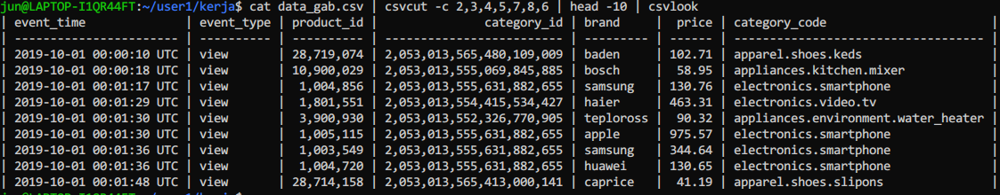

# tugas-4-sql
Submit Jawaban Tugas 4
# Panduan Olah data dengan bash

## Preview Data
Tanmpilkan masing masing data yang telah dibuat dengan menggunakan tool csvkit (csvlook).

```
csvlook 2019-Oct-sample.csv
csvlook 2019-Nov-sample.csv

```

## Merge Data
Gabungkan kedua data di atas menggunakan  tool csvkit (csvstack) kemudian simpan menjadi file baru menjadi data_gab.csv

```
csvstack 2019-Oct-sample.csv 2019-Nov-sample.csv > data_gab.csv

```

## Merge Data
Tampilkan Hasil gabungan tersebut 
Note: kalau tidak menggunakan 'head' maka data tidak bisa tampil (sniffing error) karena terlalu banyak baris.

```
cat data_gab.csv | head -10 | csvlook

```
Hasilnya:


## Seleksi Kolom
Dari list kolom yang ada ambil kolom yang relevan untuk ditampilkan menggunakan csvcut.
Berikut daftar kolom beserta urutannya.
  1:
  2: event_time
  3: event_type
  4: product_id
  5: category_id
  6: category_code
  7: brand
  8: price
  9: user_id
  10: user_session

```
csvcut -c 2,3,4,5,7,8,6

```

Hasilnya:



## Filter Baris
Setelah di filter Kolom kamudian kita filter baris dengan kriteria event type = purchase menggunakan csv grep


```
csvgrep -c "event_type" -m purchase

```
Hasilnya:


## Split Kolom
Pada kolom terkahir Category Ccode kita akan split mnjadi 2 kolo dengan kolom pertama adalah mengambil kata pertama dan kolom terkahir mengambil kata terkahir emnggunakan "awk".
* Pertama-tama kita split kolom untuk mengambil kata pertama dan membuat judul kolom menjadi "categori" dan "produk_name".

```
awk 'BEGIN{FS=OFS=","} NR==1{$7="category,product_name"} NR>1 {sub(/[.]/, ",",$7)}1' 

```
$7 menandakan kolom category_code setelah dilakukan cuit menjadi kolom ke 7

* Selanjutnya pada kolom product_name kita ambil kata terkahir saja (kata yang lain dihilangkan)

```
awk 'BEGIN{FS=OFS=","} {$8=A[split($8,A,".")]}1' 

```
$8 menandakan kolom product_name setelah dilakukan cuit menjadi kolom ke 8

Hasilnya:


## Gabung Command

Kita dapat menggabungkan semua command menjadi satu baris dan melihat preview hasilnya
``` 
cat data_gab.csv | csvcut -c 2,3,4,5,7,8,6 | csvgrep -c "event_type" -m purchase | awk 'BEGIN{FS=OFS=","} NR==1{$7="category,product_name"} NR>1 {sub(/[.]/, ",",$7)}1' | awk 'BEGIN{FS=OFS=","} {$8=A[split($8,A,".")]}1' |head -10 | csvlook

```


Kemudian data tersebut kita simpan menjadi "data_clean.csv"

```
cat data_gab.csv | csvcut -c 2,3,4,5,7,8,6 | csvgrep -c "event_type" -m purchase | awk 'BEGIN{FS=OFS=","} NR==1{$7="category,product_name"} NR>1 {sub(/[.]/, ",",$7)}1' | awk 'BEGIN{FS=OFS=","} {$8=A[split($8,A,".")]}1' > data_clean.csv
```

Hasilnya:


## Validasi Data

Hasil Data Tersebut dapat di validasi sebagai berikut:

Hasilnya:

<img src="img/bash-val-data.png" width="1000"/
